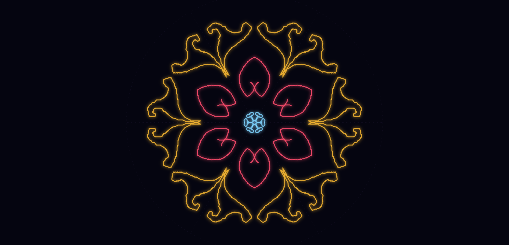
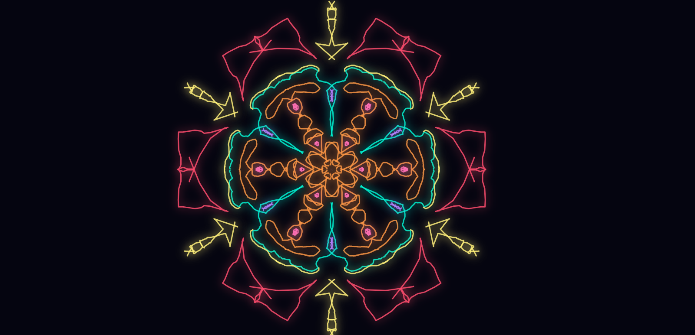
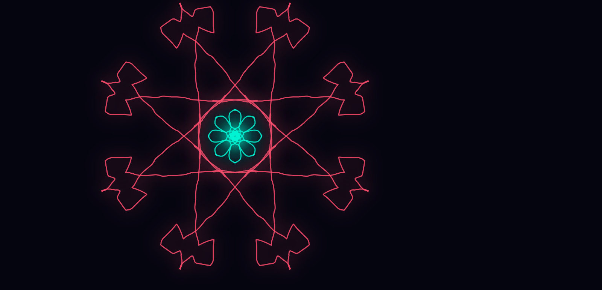
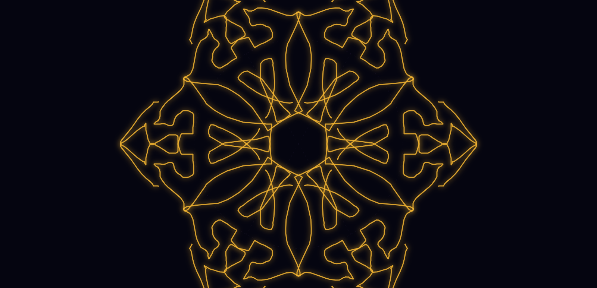
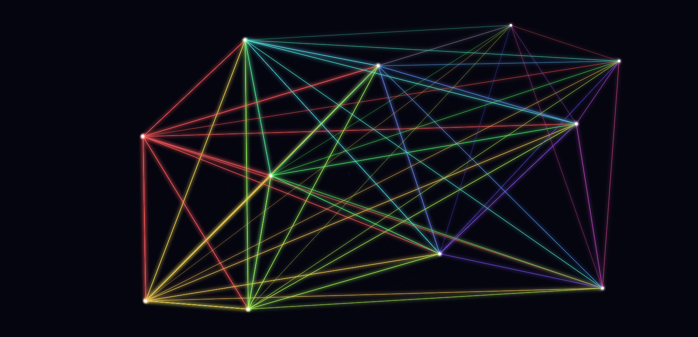
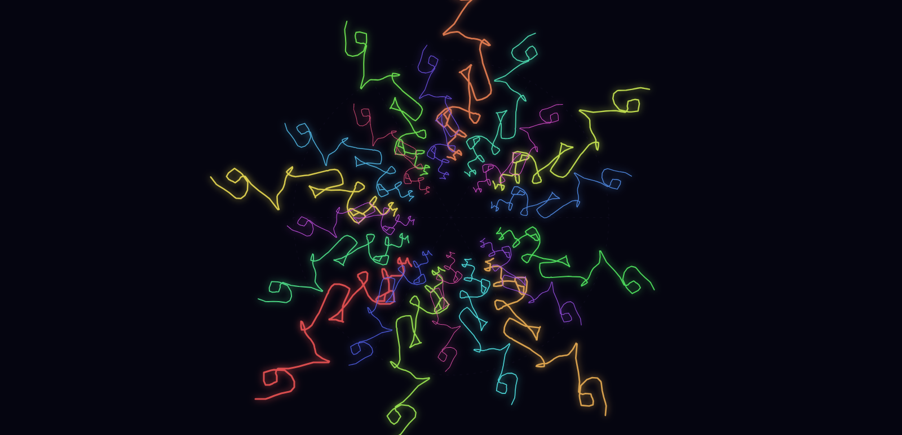
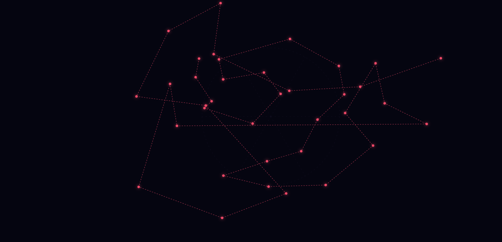
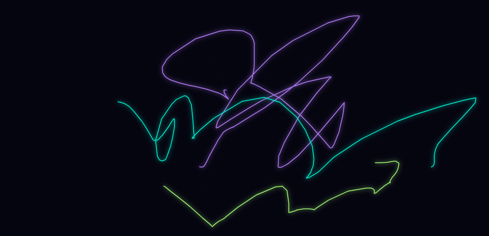
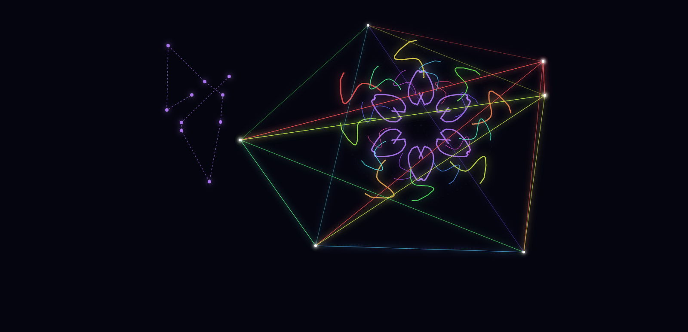

<div align="center">

# ✦ Mandala Studio

### *An Infinite, Interactive Geometric Art & Sacred Geometry Simulator*

[](https://your-deployment.vercel.app)
[](https://github.com/malikarslanasif131?tab=repositories)
[](LICENSE)
[](index.html)

<br/>

> *Draw radiant mandalas, sacred geometry, string art, and infinite spirals — all in your browser. No installs. No frameworks. Just pure creative flow.*

<br/>

<!-- REPLACE THESE WITH YOUR ACTUAL SCREENSHOTS -->


<br/><br/>


&nbsp;

&nbsp;


</div>

---

## ✨ What is Mandala Studio?

**Mandala Studio** is a fully self-contained, single-file browser app for creating stunning geometric art. Inspired by tools like MandalaGaba, WeaveSilk, and string art generators — but built from scratch with zero dependencies.

It features an **infinite canvas** with smooth pan & zoom, **6 distinct drawing modes**, **radial symmetry mirroring**, and a real-time **vector-based render engine** that replays your artwork at any zoom level without quality loss.

Draw something once — watch it bloom into a perfect 12-fold mandala, a recursive golden-spiral, or a web of luminous string art.

---

## 🖼️ Gallery

<div align="center">

| Mandala Mode | String Art | Spiral / Phyllotaxis |
|:---:|:---:|:---:|
|  |  |  |
| 12-fold radial symmetry | 40+ pin string web | Golden angle (137.5°) |

| Polygon Radial | Free Draw + Glow | Cosmos Background |
|:---:|:---:|:---:|
|  |  |  |
| Symmetrical polygon tiling | Freehand with neon glow | Star field + dark nebula |

</div>

---

## 🚀 Features

### 🎨 6 Drawing Modes
| Mode | Description |
|------|-------------|
| **⬡ Mandala** | Radial symmetry drawing — every stroke is mirrored across 4, 6, 8, 10, 12, or 16 axes simultaneously |
| **✏ Free Draw** | Unconstrained brush anywhere on the infinite canvas |
| **⬤ String Art** | Click to place pins; the app auto-connects every pin pair with rainbow gradient lines |
| **◎ Spiral** | Each stroke spawns 20 rotated + scaled copies using the golden angle (137.5°) — creates natural phyllotaxis patterns |
| **⬡ Polygon** | Click to lay vertices; double-click or snap-to-close to render it radially with fill |
| **◌ Erase** | Smooth erase using `destination-out` compositing, replayed correctly in vector history |

### 🌌 Infinite Canvas
- **Smooth pan** with Middle Mouse Button or Right Mouse drag
- **Pinch-to-zoom** on touch devices
- **Mouse wheel zoom** centered on cursor (factor 1.13×)
- **Zoom In / Out / Reset** buttons with live `%` indicator
- Vector history means **no pixelation at any zoom level** — zoom to 4000% and strokes stay crisp

### 🔮 Visual Polish
- Subtle **glow / bloom** on all strokes (`shadowBlur` per draw call)
- **Three backgrounds**: Dark void · Pure white · Cosmos (radial nebula + 400 seeded stars that pan with the world)
- Slow **rotation animation** (⟳ Rotate mode) — the whole artwork meditatively spins while you can still draw into it
- Anti-aliased, smooth strokes with configurable **line cap** (round / butt / square)

### ⚙️ Full Brush Control
- Color picker + 12 preset neon/pastel swatches
- Brush size: 1–40 px
- Opacity: 0.05–1.0
- Line cap: Round · Butt · Square
- Symmetry: 4 / 6 / 8 / 10 / 12 / 16 axes

### 💾 Undo & Save
- **10-step undo** (vector snapshot — instant, no ImageData memory cost)
- **Save as PNG** — exports the current view at screen resolution
- **Hide / Show UI** — clean fullscreen drawing experience

---

## 🏗️ Architecture

Mandala Studio uses a **vector command history** system — the key to the infinite canvas:

```
history[]  ←  array of drawing commands in world space
              each command stores: type, points, color, size, mode, symmetry…

renderAll()
  ├── drawBg()              — fills screen, draws stars in world space
  ├── drawGuide()           — subtle axis/circle helper
  ├── for cmd of history    — replay every command
  │     └── replayCommand() → applyCameraTransform() → draw in world coords
  └── liveStroke overlay    — in-progress stroke drawn on top
```

### Coordinate System

```
Screen Space         World Space (mandala frame)
─────────────        ───────────────────────────
Raw px on canvas     Origin (0,0) = mandala center
                     Independent of zoom/pan/rotation

screenToWorld(sx, sy):
  1. Remove screen center + pan offset, divide by zoom
  2. Un-rotate by camera.rotation   ← this is why drawing
                                       while rotating works!
```

### Camera Transform

```javascript
// Applied before every world-space draw call:
ctx.translate(screenCX + panX, screenCY + panY);  // move origin to mandala center
ctx.rotate(camera.rotation);                        // global art rotation
ctx.scale(camera.zoom, camera.zoom);               // zoom
```

### Mandala Symmetry Logic

```javascript
// For each of `symmetry` axes:
for (let s = 0; s < symmetry; s++) {
  ctx.rotate((2π / symmetry) * s);   // rotate to this axis

  // Draw original stroke
  ctx.stroke(path);

  // Mirror: flip y-axis = reflection across x-axis
  ctx.scale(1, -1);
  ctx.stroke(path);  // reflected copy
}
// Result: 2× symmetry "petals" — a true mandala
```

---

## 📂 Project Structure

```
mandala-studio/
│
├── index.html              ← The entire app (single self-contained file)
│
├── demo/
│   ├── screenshot-main.png ← Main UI screenshot
│   ├── pattern-1.png       ← Sample generated artwork
│   ├── pattern-2.png
│   ├── pattern-3.png
│   ├── gallery-mandala.png
│   ├── gallery-string.png
│   ├── gallery-spiral.png
│   ├── gallery-polygon.png
│   ├── gallery-free.png
│   └── gallery-cosmos.png
│
└── README.md
```

---

## 🖥️ Running Locally

No build step. No dependencies. Just open the file:

```bash
# Clone the repo
git clone https://github.com/malikarslanasif131/mandala-studio.git
cd mandala-studio

# Option 1: Open directly in browser
open index.html

# Option 2: Serve with any static server
npx serve .
# or
python -m http.server 8080
```

Then visit `http://localhost:8080`

---

## 🌐 Deploy to Vercel

```bash
# Install Vercel CLI
npm i -g vercel

# Deploy from project root
vercel

# Or connect your GitHub repo at vercel.com → Import Project
```

Vercel will auto-detect the static site and deploy instantly. No configuration needed.

---

## 🎮 Controls & Shortcuts

| Action | Input |
|--------|-------|
| Draw | Left mouse drag / touch drag |
| Pan view | Middle mouse drag **or** Right mouse drag |
| Zoom in/out | Mouse scroll wheel |
| Pinch zoom | Two-finger pinch (touch) |
| Place pin (String Art) | Left click |
| Add polygon point | Left click |
| Close polygon | Click near first point **or** double-click |
| Undo | Click ↩ Undo button |
| Clear | Click ✕ Clear button |
| Hide UI | Click ⊡ Hide UI button |
| Show UI | Click the floating ✦ button |
| Save PNG | Click ↓ Save PNG |

---

## 🛠️ Technical Details

| Detail | Value |
|--------|-------|
| **Dependencies** | Zero (vanilla HTML/CSS/JS only) |
| **Canvas** | HTML5 `<canvas>` with `2d` context |
| **Render strategy** | Full vector replay from history on each frame |
| **Undo** | JSON deep-copy snapshots of command array |
| **Animation** | `requestAnimationFrame` loop (only when ⟳ Rotate is active) |
| **Zoom range** | 4% → 4000% |
| **Symmetry options** | 4, 6, 8, 10, 12, 16 axes (+ reflection = 2×) |
| **Spiral repeats** | 20 rotated+scaled copies per stroke |
| **Star field** | 400 stars with seeded PRNG (Mulberry32), pans with world |
| **File size** | ~48 KB (no assets, no libraries) |
| **Browser support** | All modern browsers (Chrome, Firefox, Safari, Edge) |
| **Mobile** | Touch drawing + pinch-to-zoom fully supported |

---

## 🎯 Roadmap / Ideas

- [ ] Export as SVG (true vector output)
- [ ] Keyboard shortcuts (B = brush, E = erase, Z = undo, Space = pan)
- [ ] Custom symmetry count input (e.g., 24, 36)
- [ ] Pressure sensitivity via Pointer API
- [ ] Shareable URL (encode art as compressed JSON in URL hash)
- [ ] Background music / ambient sound integration
- [ ] Layer system (multiple independent drawing layers)
- [ ] Color gradient along stroke (hue shift as you draw)

---

## 👤 Author

**Malik Arslan Asif**

[](https://github.com/malikarslanasif131?tab=repositories)

---

## 📄 License

This project is open source under the [MIT License](LICENSE).

---

<div align="center">

*Made with ✦ and a lot of radial symmetry*

**[⭐ Star this repo](https://github.com/malikarslanasif131/mandala-studio) if you found it beautiful or useful!**

</div>
